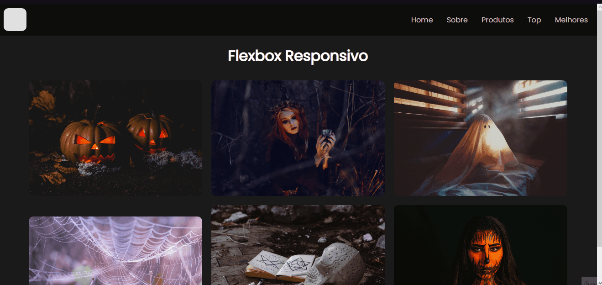

# Site Responsivo
##
* <h2>Objetivo final é ter um site responsivo;</h2>
* <h2>Apenas HTML e CSS;</h2>
* <h2>CSS Grid e Flexbox;</h2>
  
 
    <h2 align="center">
    ⛔Ainda em Desenvolvimento⛔
    </h2>
 

 
    <h1 align="center">
        
    </h1>